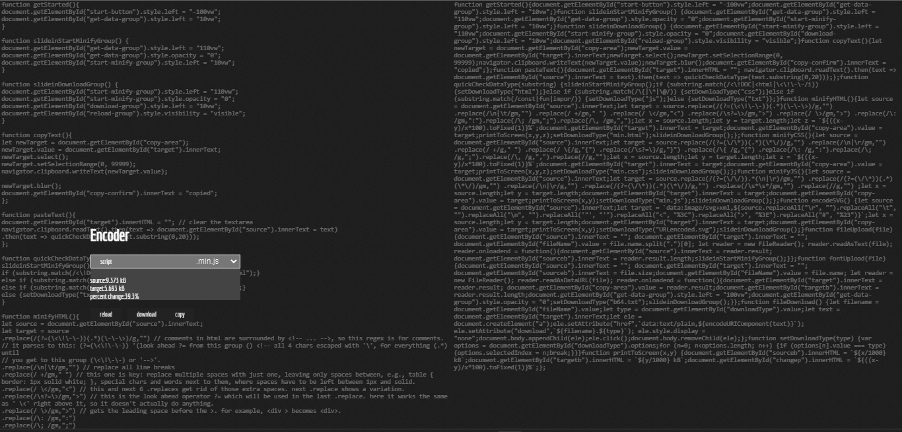

# Encoder-Minifier

Deployed [here](https://encoder-minifier.netlify.app/)

## Purpose
Minify and encode production scripts / fonts / icons / images.
* Source code minification (HTML / CSS / JS)
* Base-64 image conversion (any image format)
* Base-64 font conversion (any font format)
* URL-Encoding SVG (NB: Used in specific cases as it removes functionality)

At this time, each function is a standalone task; but, a future version will likely be a complete build option in addition to the individual tasks.

## Code Summary
* Coded in vanilla JS, uses fileReader, encodeURIComponent, and RegEx matching (sample below)
```javascript
let target = source
  .replace(/(?=(\<\!\-\-))(.*)(\-\-\>)/g,"") 
  .replace(/\n|\t/gm,"")
  .replace(/ +/gm," ") 
  .replace(/ \</gm,"<")
  .replace(/\s?=\>/gm,">") 
  .replace(/ \>/gm,">")
  .replace(/\: /gm,":")
  .replace(/\; /gm,";")
  .replace(/\, /gm,",");
```

## Screenshot
JavaScript, ~ 40% reduction (mostly from comments)


## License
[CC BY 4.0](https://creativecommons.org/licenses/by/4.0/)